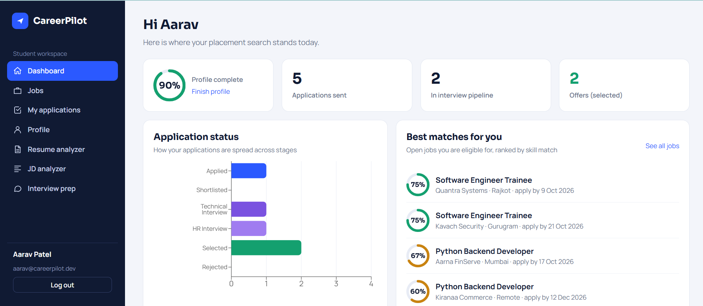
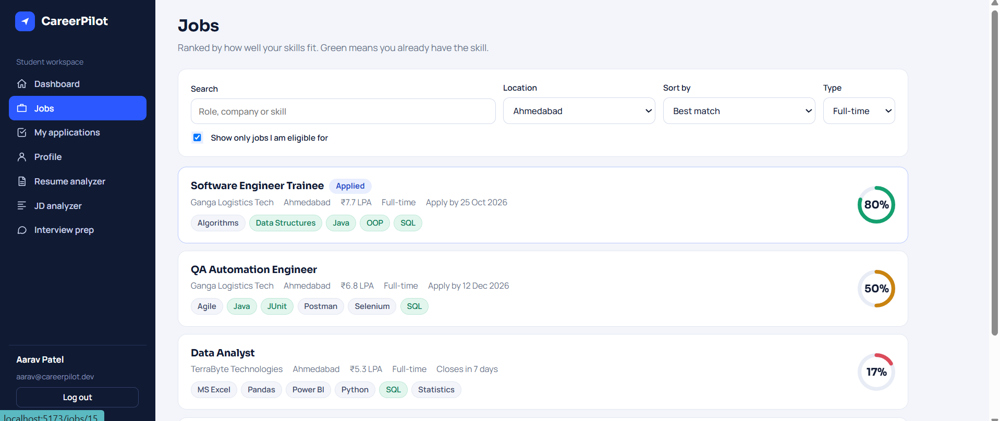
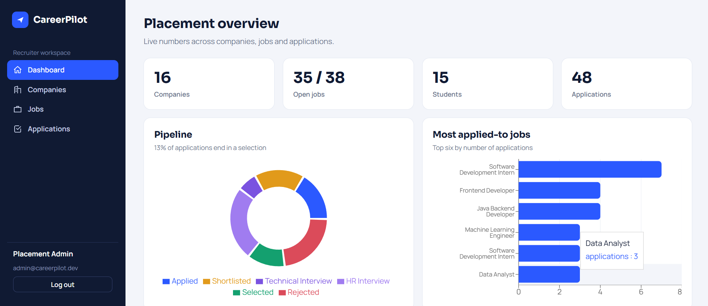
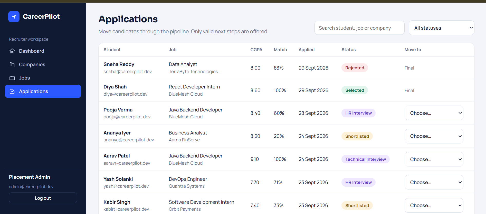

# CareerPilot: AI-Assisted Placement & Job Management Platform


Students check eligibility, see a skill-match score for every job, apply, and track each application through a hiring pipeline. Recruiters manage companies, jobs and candidates. AI helps with resume feedback, JD parsing and interview practice, but **core matching and security never depend on AI**.


## Table of Contents
- [Problem Statement](#problem-statement)
- [Features](#features)
- [Tech Stack](#tech-stack)
- [Screenshots](#screenshots)
- [Quick Start (VS Code)](#quick-start-in-vs-code-about-3-minutes)
- [Demo Accounts](#demo-accounts)
- [Dataset](#dataset)
- [Run with Docker](#run-with-docker-postgresql--backend--frontend)
- [AI Features](#ai-features)
- [Architecture](#architecture)
- [Database Design](#database-design)
- [REST API](#rest-api)
- [Tests](#tests)
- [Environment Variables](#environment-variables)
- [Project Structure](#project-structure)
- [Suggested Git History](#suggested-git-history)
- [Interview Cheat Sheet](#interview-cheat-sheet)
- [Future Improvements](#future-improvements)

## Problem Statement
Students apply without knowing whether they meet eligibility rules, which skills they lack, or how to track many applications. CareerPilot puts all of this in one place.

## Features

**For students**
- Register, log in and manage a profile (CGPA, degree, graduation year, skills, projects, certifications)
- Browse and search jobs, sorted by match %, deadline, salary or recency
- See a **skill-match percentage** and **eligibility result** on every job
- Apply with one click (one application per job, enforced)
- Track every application through the hiring pipeline
- Upload a resume (PDF/TXT) and get AI feedback
- Practice with AI-generated interview questions

**For recruiters / admins**
- Manage companies and job postings
- Review all applications and move candidates through the pipeline
- View an admin dashboard with hiring statistics
- Parse job descriptions with AI

**Engineering highlights**
- Deterministic, explainable, unit-tested matching (no AI involved)
- Stateless JWT security with role-based access
- Validated status transitions
- AI with a rule-based fallback, so the app works without an API key
- Zero-setup local run (H2), PostgreSQL via Docker

## Tech Stack

| Layer | Technology |
|---|---|
| Backend | Java 17, Spring Boot 3, Spring Security + JWT, Spring Data JPA/Hibernate |
| Database | H2 (zero-setup) or PostgreSQL |
| Frontend | React 18, Vite, Recharts |
| AI | Anthropic API (optional) with local fallback |
| Testing | JUnit 5, Mockito |
| DevOps | Docker Compose |

## Screenshots

### Student

| Dashboard | Job Detail (match % + eligibility) |
|---|---|
|  |  |

### Recruiter / Admin

| Admin Dashboard | Applications Management |
|---|---|
|  |  |

## Quick start in VS Code
Prerequisites: **JDK 17+**, **Maven 3.9+**, **Node 18+**. Install the recommended extensions when VS Code prompts (Extension Pack for Java, Spring Boot Extension Pack).

```bash
# 1. Frontend (terminal 1)  ->  http://localhost:5173
cd frontend
npm install
npm run dev

# 2. Backend (terminal 2)  ->  http://localhost:8080
cd backend
mvn spring-boot:run
```

**If `mvn` is not recognized**, Maven's `bin` folder is not on your PATH. Run it with the full path instead:

Command Prompt (cmd):
```cmd
"C:\path\to\apache-maven-3.9.x\bin\mvn.cmd" spring-boot:run
```

Or add Maven permanently: Windows search → **Edit the system environment variables** → **Environment Variables** → select `Path` → **Edit** → **New** → paste the Maven `bin` folder path → OK, then reopen the terminal and check with `mvn -v`.

Or press `Ctrl+Shift+P` → **Tasks: Run Task** → **Run CareerPilot (backend + frontend)**.

The first start creates a local H2 database in `backend/data/` and loads the demo dataset automatically.

## Demo Accounts

| Role | Email | Password |
|---|---|---|
| Student (richest demo data) | `aarav@careerpilot.dev` | `Student@123` |
| Other students | `diya@`, `rohan@`, `ananya@`, `kabir@` … `@careerpilot.dev` | `Student@123` |
| Recruiter / admin | `admin@careerpilot.dev` | `Admin@123` |

> These are fictional demo credentials for local use only. Change or disable seeding (`SEED_ENABLED=false`) in any real deployment.

## Dataset
`dataset/generate_dataset.py` builds a reproducible, fully fictional dataset: **67 skills, 16 companies, 38 jobs (incl. internships and closed postings), 14 student profiles, 48 applications** across every pipeline stage. It writes `backend/src/main/resources/seed/seed.json` (loaded by `DataSeeder` when the DB is empty) and CSVs in `dataset/` for Excel.

- **Reset:** stop the backend, delete `backend/data/`, start again.
- **Regenerate:** `python dataset/generate_dataset.py`

## Run with Docker (PostgreSQL + backend + frontend)
```bash
cp .env.example .env      # set JWT_SECRET, optionally ANTHROPIC_API_KEY
docker compose up --build
# App: http://localhost:3000   API: http://localhost:8080
```
On Windows cmd, use `copy .env.example .env` instead of `cp`.

## AI Features
Set `ANTHROPIC_API_KEY` (env var, backend only; never in frontend code) to use a real LLM. Optional `ANTHROPIC_MODEL`.

- Without a key, or if the API fails, the endpoints return a **rule-based fallback** and the UI shows a notice.
- LLM output is requested as JSON and validated before use.
- Resume text is treated as untrusted data in the prompt.

## Architecture
```
React (Vite) -> Controller -> Service -> Repository -> PostgreSQL / H2
                    |
                    +-> AiService -> LLM API -> validated JSON (or local fallback)
JWT filter + Spring Security guard every /api route. Business rules live only in the service layer.
```
Packages in `com.careerpilot`: `controller/ service/ repository/ entity/ dto/ security/ exception/ config/`

| Module | Why it exists | Key classes |
|---|---|---|
| Auth | Register/login, BCrypt hashing, stateless JWT, role checks | `AuthService`, `JwtService`, `JwtAuthFilter`, `SecurityConfig` |
| Matching | `Match % = matched required skills / total required × 100` using a `HashSet` (O(1) lookups, O(S+R) total); 0 required skills = 100% | `MatchService` |
| Eligibility | CGPA, graduation year, accepted degrees, deadline, open/closed | `EligibilityService` |
| Applications | One application per student per job (service check + DB unique constraint); validated status transitions | `ApplicationService`, `ApplicationStatus` |
| AI | Resume / JD analysis, interview questions, graceful fallback | `AiService` |

**Status flow**

```
Applied → Shortlisted → Technical Interview → HR Interview → Selected
              (Rejected is allowed from any open stage)
```
Invalid jumps return **400** with the allowed options.

## Database Design
```
users(id, email, password_hash, role, created_at)
students(id, user_id, name, college, degree, cgpa, graduation_year, phone, projects, certifications)
skills(id, name)
student_skills(student_id, skill_id)
companies(id, name, location, website)
jobs(id, company_id, title, description, minimum_cgpa, location, salary_lpa, deadline, status, job_type, graduation_year, allowed_degrees)
job_skills(job_id, skill_id)
applications(id, student_id, job_id, status, applied_at, updated_at, UNIQUE(student_id, job_id))
resumes(...)
interview_sessions(...)
interview_questions(...)
```

**Relationships:** User 1–1 Student · Student M–N Skill · Job M–N Skill · Company 1–N Job · Student 1–N Application · Job 1–N Application · Student 1–N Resume · InterviewSession 1–N InterviewQuestion.

**Indexes:** `jobs.status`, `jobs.deadline`, `applications.status`.

## REST API
| Method | Endpoint | Access |
|---|---|---|
| POST | `/api/auth/register`, `/api/auth/login` | public |
| GET/PUT | `/api/students/profile` | student |
| POST | `/api/students/resume` (multipart PDF/TXT) | student |
| GET | `/api/skills` | any user |
| GET | `/api/jobs?q=&location=&sort=match\|deadline\|salary\|recent` | any user (students get match % + eligibility) |
| GET | `/api/jobs/{id}`, `/api/jobs/{id}/match` | any user / student |
| POST/PUT/DELETE | `/api/jobs`, `/api/jobs/{id}` | admin |
| GET/POST/PUT/DELETE | `/api/companies` | read: any, write: admin |
| POST | `/api/applications` | student |
| GET | `/api/applications`, `/api/applications/{id}` | student (own) / admin (all) |
| PUT | `/api/applications/{id}/status` | admin |
| POST | `/api/ai/resume-analysis`, `/api/ai/jd-analysis`, `/api/ai/interview` | authenticated |
| GET | `/api/dashboard/student`, `/api/dashboard/admin` | student / admin |
| GET | `/api/health` | public |

Import `postman/CareerPilot.postman_collection.json` into Postman. Run the login requests first; they save the JWTs.

## Tests
```bash
cd backend
mvn test
```
Covers:
- Skill matching: full, partial, case, empty, zero-required, rounding
- Eligibility: CGPA, year, degree, deadline, closed
- Status transitions
- Duplicate application prevention (Mockito)
- Ineligible apply, missing job (404)
- Valid and invalid status updates

## Environment Variables

| Variable | Purpose | Default |
|---|---|---|
| `DB_URL`, `DB_USER`, `DB_PASSWORD` | Database connection | local H2 |
| `JWT_SECRET` | JWT signing key (32+ chars) | none, set it |
| `ANTHROPIC_API_KEY`, `ANTHROPIC_MODEL` | Real LLM for AI features | rule-based fallback |
| `CORS_ORIGINS` | Allowed frontend origins | local dev origins |
| `SEED_ENABLED` | Load demo dataset on empty DB | `true` |
| `VITE_API_URL` (frontend) | API base URL | `/api` (proxied in dev) |

**Never commit `.env`.**

## Project Structure
```
careerpilot/
├── backend/          # Spring Boot app (com.careerpilot.*)
├── frontend/         # React + Vite app
├── dataset/          # generate_dataset.py + CSVs
├── postman/          # CareerPilot.postman_collection.json
├── docs/
│   └── screenshots/  # README images
├── docker-compose.yml
├── .env.example
└── README.md
```

## Suggested Git History
`1 project setup` → `2 database/entities` → `3 authentication` → `4 job management` → `5 applications` → `6 matching` → `7 frontend` → `8 AI` → `9 testing` → `10 Docker/docs`

Use branches `feature/auth`, `feature/jobs`, `feature/matching`, `feature/ai`.

## Interview Cheat Sheet
- **Why DTOs?** Entities never leave the service layer, so the API shape is stable and no sensitive fields leak (e.g. `passwordHash`).
- **Where is HashSet used?** `MatchService`: student skills in a HashSet, then one O(1) check per required skill.
- **Why isn't matching done by AI?** It must be deterministic, explainable, testable and free; AI only coaches.
- **Preventing double applications?** Service check for a friendly 409, plus a DB unique constraint to stay safe under concurrent requests.
- **JWT flow?** Login → signed token with role claim → `JwtAuthFilter` validates on each request → `SecurityConfig` enforces roles. Stateless, so no server sessions.
- **When the AI API fails?** `AiService` catches the error and returns a labelled fallback; the app keeps working.
- **At 100k users?** Pagination, DB-level filtering and indexes, caching hot job lists, async AI calls with rate limits, read replicas.
- **N+1 problem?** `JobRepository.findAllDetailed()` uses `@EntityGraph` to fetch company and skills in one query.

## Future Improvements
- Pagination and server-side filtering
- Email notifications on status change
- Resume file storage
- Refresh tokens
- Rate limiting on AI endpoints
- Integration tests with Testcontainers
